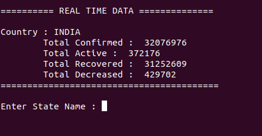
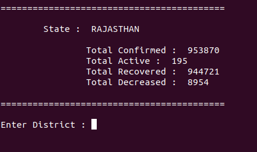
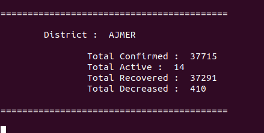

<h3 align="center">COVID 19 REALTIME DATA</h3>

---

<div align="center">

[](https://github.com/harshraj8843/covid-19)

 

</div>

---

## 📝 Table of Contents

- [About](#about)
- [Getting Started](#getting_started)
- [Screenshots](#screenshots)

## 🧐 About <a name = "about"></a>

A simple covid-19 realtime data fetching tool (**Only for India**)

## 🏁 Getting Started <a name = "getting_started"></a>

- clone project
  ```
  git clone https://github.com/harshraj8843/covid-19
  ```
  ```
  cd covid-19/
  ```
- run
  ```
  python3 covid.py
  ```
  or
  ```
  python covid.py
  ```

---

**NOTE :-** This programme is tested on `Ubuntu 20.04`

---

## Screenshots <a name = "screenshots"></a>

<p align="center">

</p>

<p align="center">

</p>

<p align="center">

</p>

---

Dev Period :- `May 2020`

---

<p align="center">
Thanks :)
</p>
